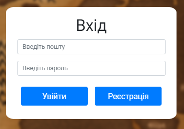
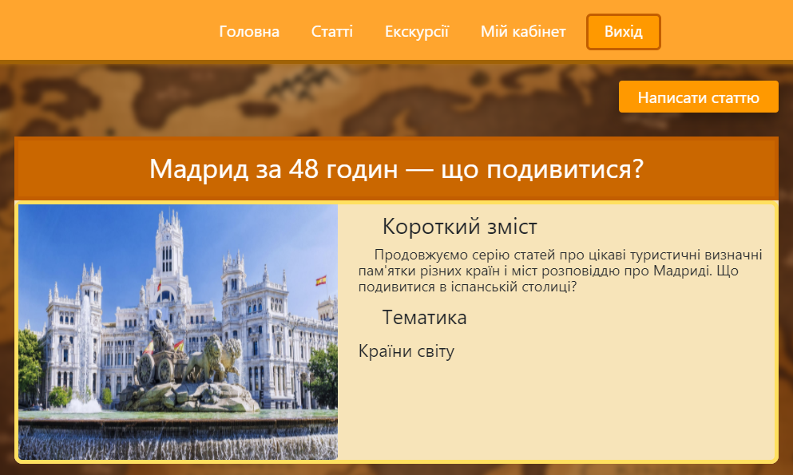
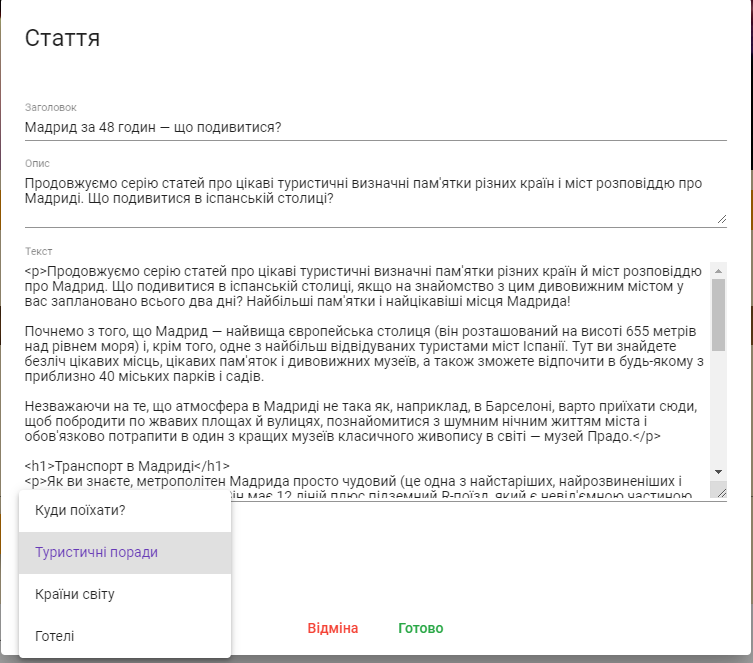
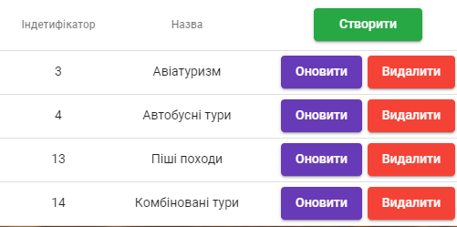
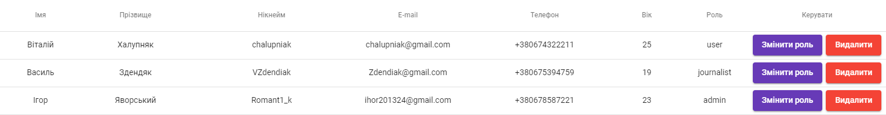
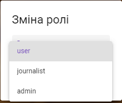

# Tourist club
This project is a web application in which users can read and comment on travel articles, search for tours and book tickets for them.  
Users are divided by roles: "user", "journalist", "admin". Access levels are issued depending on the role.  
For more details, see the screenshots below or read the file "READ.docx"

## Used in the development
  1. C#
  2. ASP.NET Core WEB API
  3. Mediator
  4. CQRS
  5. Angular 8
  6. HTML5
  7. SCSS

## Screenshots
#### ER - diagram.
    

### Access level: user
#### Header.    
    

#### Footer.    
    

#### Sign up form.    
    

#### Entrance form.    
   

#### User page.
  

#### Change password page.
  

#### My reservation page.
  

#### Technical support page.
  

#### Acticles page.  
  

#### Acticle page.  
  

#### Comment block on acticle page.  
  

#### Exursions page.  
  

#### Exursion page.  
  

#### Reservation form on excursion page.  

### Access level: journalist
#### Articles page(new button for journalist).  

#### Add artice form.  

#### Buttons for modify article on her page.  

#### Update article form.  

### Access level: admin
#### Admin panel. Tables:

#### Admin panel. Some forms:

